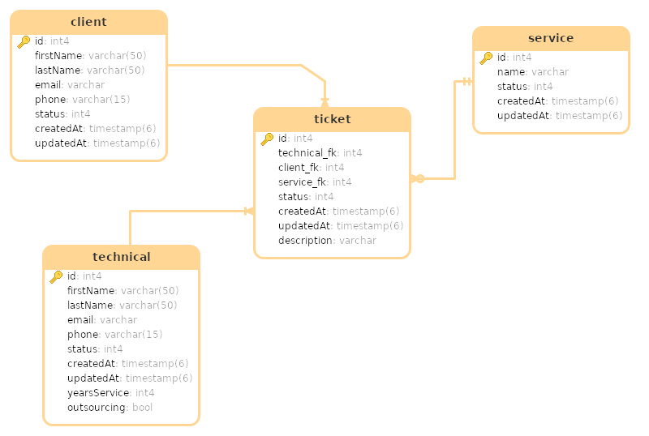

# TV Services Company

Data Base Models

The **tv-services.sql** file contains the database structure with its respective tables and columns, just run it in **PostgreSQL** and start managing the data.

## Diagram MER 

